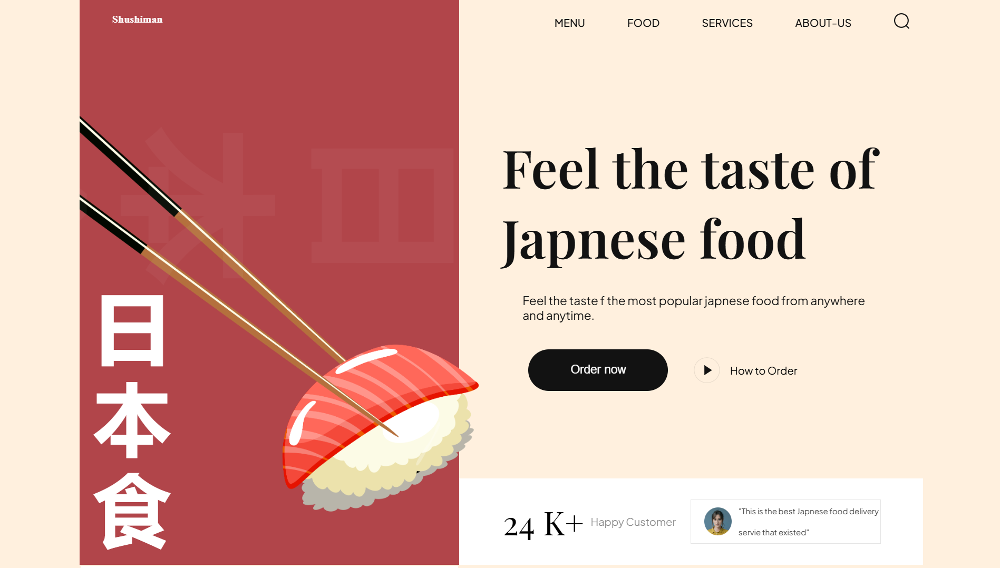

# Sushi Landing Page 🍣

A modern, responsive sushi-themed landing page built using HTML and CSS. This static website is visually appealing and fully optimized for both desktop and mobile devices, making it ideal for food businesses, restaurants, or portfolios.

## 🌟 Features

- Clean, minimal layout with elegant typography
- Smooth scroll and animation effects for better user experience
- Fully responsive design across all screen sizes

## ⚙️ Technologies Used

- HTML
- Tailwind CSS
- JavaScript

## 📸 Screenshots

Here is a preview of the Sushi Themed Landing Page:



## 🚀 How to Run the Project

1. Clone the repository:
   ```bash
   git clone https://github.com/Ansari-Soman/Sushi-Themed-Landing-Page.git

2. Navigate into the project folder:
   ```bash
   cd student-management-system


## 🙌 Author

- [Ansari Soman](https://github.com/Ansari-Soman)

---

Feel free to use this project for learning or personal use!
